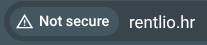
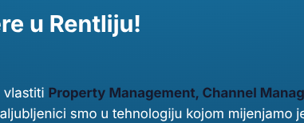

Dear Rentlio Team,

As a prospective team member, I wanted to highlight a few areas where I believe Rentlio’s digital experience can be improved:

1. **HTTPS Redirection:** [rentlio.hr](https://rentlio.hr) currently has an invalid or missing HTTPS certificate and does not redirect properly.  
   
2. **Accessibility:** The [careers page](https://rentlio.peopleforce.io/careers) has low contrast, making it difficult to read for some users.  
   
3. **User Experience:** The scroll reveal pattern on the [about us](https://rentl.io/o-nama) page can be distracting and may frustrate users.

Over the past few years, I’ve focused on making my personal infrastructure immutable, auditable, and resilient (see my [covik/system32](https://github.com/covik/system32) project for more details).

My ideal area of work is developer support—improving development velocity and experience. If this doesn’t align with your immediate needs, I’m equally comfortable contributing to infrastructure, backend, frontend, or any combination.

Sincerely,  
Mate
